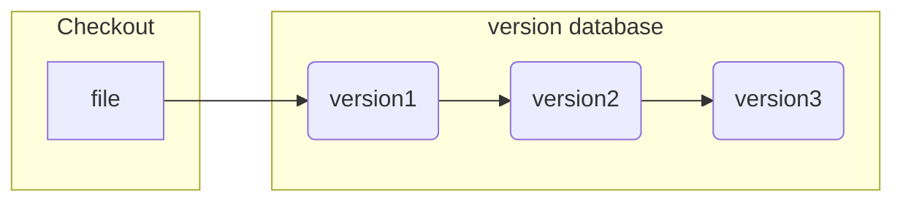
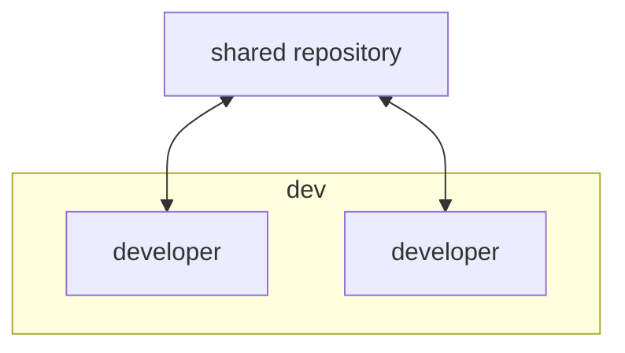
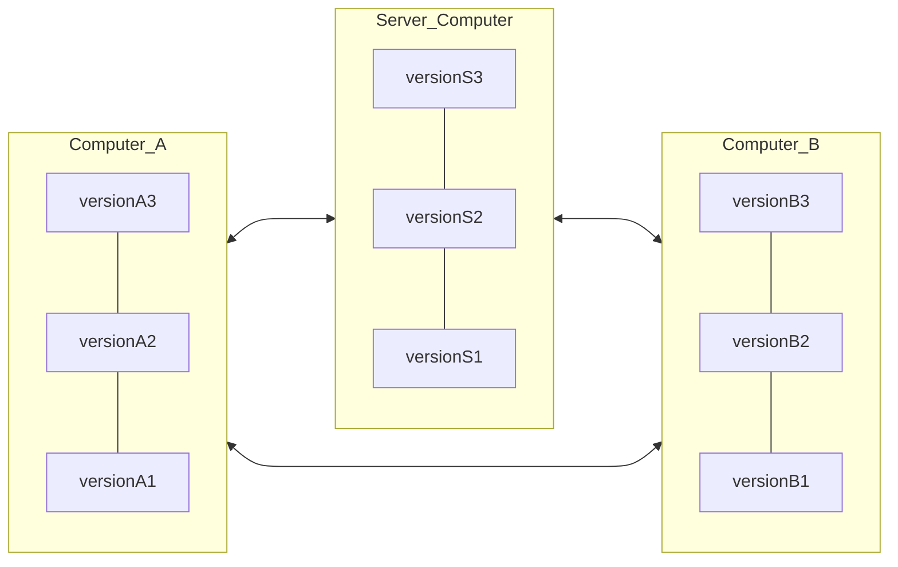

# 起步

## 版本控制（version control system）

 版本控制是一种记录一个或多个文件内容变化，以便将来查阅特定版本修改的系统。

 如果你是正在编写代码，可能会需要保存已经实现某一功能的版本，当你在该版本的基础上造成了不可避免的错误或你需要会输到该版本，使用版本控制系统（VCS）可以让你轻松恢复到原先的样子。

### 本地版本控制系统（local version control system）

 是将文件的各个版本以一定的数据格式存储在本地磁盘上（有的 VCS 是保存文件的变化补丁，在文件内容变化时计算出差量并保存）。这种方式在一定程度上解决了复制粘贴的问题，但无法解决多人协同的问题。



### 集中式版本管理系统（centralized version control system）

 与 LVCS 相比，只是多了一个中央服务器，各个版本的数据库存储在中央服务器，管理员可以控制开发人员的权限，开发人员可以从中央服务器拉取数据。

 虽然 CVCS 解决了多人协同的问题，但是中央服务器一旦宕机或遭到顺坏，那么会造成巨大的损失。



### 分布式版本控制系统（distributed version control system）

 与 LVCS 和 CVCS 不同，在 DVCS 中，像 git，mercurial 等，系统保存的不是文件变化的差量，而是文件的快照和代码仓库的快照，即把文件的整体复制下来，不关心具体的变化内容。

 分布式，即当你从中央服务器拷贝代码时，你拷贝的是一个完整的版本库，包括历史纪录，提交记录等。每一次的克隆操作，实际上都是一次对代码仓库的完整备份。



## git是什么？

git是一个分布式版本控制系统，它与其他版本控制系统的主要差别在于对待数据的方式。

git中所有的数据都会SHA-1散列（哈希）来实行校验和机制。SHA-1是一个由40个十六进制字符组成的字符串，基于Git中文件的内容或目录结构计算出来的。

```
git操作，显示SHA-1的值（commit id）

显示当前分支的哈希值：git rev-parse HEAD
像这样：dfd55c8a7883a09e1f30b078b3265f81ad99ce6c

显示当前分支哈希值的简短形式：git rev-parse --short HEAD
dfd55c8
```

